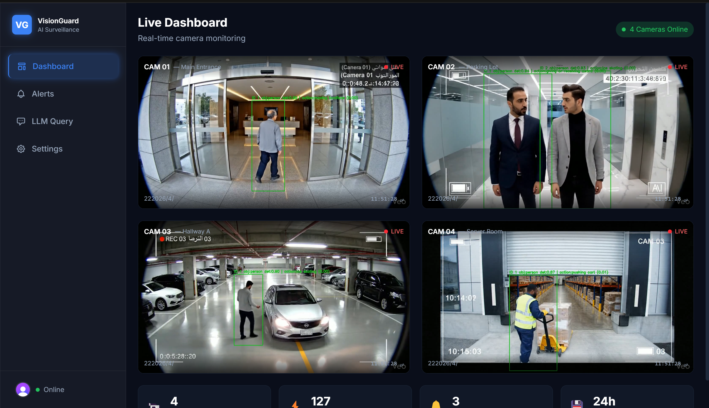

<div align="center">

# VisionGuard

### AI-Powered Smart Surveillance System for Real-Time Scene Understanding and Intelligent Alerts

[Live Demo](https://visionguard-snowy.vercel.app/) • [Source Code](https://github.com/mj0d19/VisionGuard)

</div>

---

## Overview

VisionGuard is an AI-powered smart surveillance system designed to transform conventional CCTV monitoring into an intelligent, event-driven platform.

Instead of relying entirely on continuous human observation, VisionGuard analyzes surveillance footage to detect and track people, recognize activities, understand scene context, generate security alerts, and store structured events for later investigation.

The system also provides a natural-language investigation interface, allowing users to ask questions about detected events without manually reviewing long periods of surveillance footage.

---

## Key Features

- Real-time person detection and tracking
- Persistent identity tracking and re-identification
- Human action recognition
- Scene segmentation and contextual environment understanding
- Automated event and alert generation
- Structured event logging with timestamps and metadata
- Security alert classification by severity
- Interactive event timeline
- AI-generated surveillance summaries
- Natural-language investigation interface
- Web-based monitoring dashboard
- PostgreSQL event persistence
- FastAPI backend services
- Interactive browser-based demonstration

---

## System Architecture

VisionGuard follows a modular architecture that connects computer vision models, backend services, data storage, and a web interface.

```text
Camera / Video Input
        |
        v
Object Detection & Tracking
      YOLOv8
        |
        v
Action Recognition
        X3D
        |
        v
Scene Understanding
      SegFormer
        |
        v
Event & Alert Generation
        |
        v
PostgreSQL Database
        |
        v
FastAPI Backend
        |
        +--------------------+
        |                    |
        v                    v
React Dashboard        LLM Investigation
                         Interface
```

This architecture allows the AI pipeline, backend, database, and frontend to operate as independent but connected modules.

---

## AI Pipeline

### Object Detection & Tracking

VisionGuard uses YOLOv8 to detect people within surveillance footage and maintain tracking identities across video frames.

Re-identification logic is used to improve identity continuity when subjects become temporarily occluded or leave and re-enter the scene.

### Action Recognition

The system uses X3D-based video understanding models to recognize human activities such as:

- Walking
- Standing
- Running
- Skateboarding
- Other observable activities

### Scene Understanding

SegFormer-based semantic segmentation provides additional environmental context by identifying areas and objects within the surveillance scene.

This allows detected activities to be interpreted with greater contextual awareness.

### Event Intelligence

Detected observations are converted into structured events containing information such as:

- Timestamp
- Detected subject
- Activity
- Confidence
- Scene context
- Severity
- Event description

These events can then be stored, queried, visualized, and used to generate alerts.

---

## Smart Investigation

VisionGuard provides a natural-language investigation interface for interacting with processed surveillance events.

Instead of manually searching through video footage, users can ask questions about previously detected events.

Example queries include:

```text
Show recent alerts.

Was there any critical event?

What happened during this incident?

Summarize the detected activity.
```

The system retrieves relevant event information and generates a human-readable response.

---

## Interactive Demo

A browser-based demonstration was developed to showcase the VisionGuard workflow without requiring the complete local AI environment.

The demo includes:

- Multiple surveillance scenarios
- Raw and analyzed video playback
- Simulated AI processing stages
- Detection overlays
- Event timelines
- Severity classification
- Executive AI summaries
- People and event statistics
- Smart investigation chat
- Event-to-video navigation

Try the live demo:

**https://visionguard-snowy.vercel.app/**

---

## Screenshots

### AI Video Analysis


### Event Timeline & Intelligence


### Smart Investigation


### System Dashboard



---

## Technology Stack

| Layer | Technologies |
|---|---|
| AI & Computer Vision | Python, PyTorch, YOLOv8, X3D, SegFormer |
| Video Processing | OpenCV, FFmpeg |
| Tracking & Re-Identification | YOLO Tracking, Re-ID Logic |
| Backend | FastAPI, Python |
| Database | PostgreSQL, SQLAlchemy |
| Frontend | React, Vite, JavaScript, CSS |
| LLM Integration | Ollama |
| GPU Acceleration | NVIDIA CUDA |
| Development | Git, GitHub, VS Code |
| Deployment | Vercel |

---

## Project Structure

```text
VisionGuard/
|
├── config/                 # AI and tracking configuration
├── frontend/               # React + Vite web application
├── scripts/                # Utility and setup scripts
├── src/
│   ├── alerts/             # Alert generation logic
│   ├── api/                # FastAPI backend
│   ├── database/           # Database models and persistence
│   ├── events/             # Event processing and logging
│   ├── llm/                # LLM integration
│   ├── models/             # AI model modules
│   ├── notifications/      # Notification services
│   └── pipeline/           # Video processing pipeline
|
├── main.py                 # Main AI processing entry point
├── requirements.txt        # Python dependencies
└── vercel.json             # Frontend deployment configuration
```

---

## Getting Started

### Requirements

Before running the complete system locally, install:

- Python 3.10+
- Node.js
- PostgreSQL
- npm
- Git

An NVIDIA GPU with CUDA support is recommended for AI inference.

### Clone the Repository

```bash
git clone https://github.com/mj0d19/VisionGuard.git
cd VisionGuard
```

### Install Python Dependencies

```bash
python -m venv .venv
pip install -r requirements.txt
```

### Configure PostgreSQL

Create a PostgreSQL database and configure the required database credentials for the backend.

### Start the FastAPI Backend

```bash
uvicorn src.api.main:app --reload
```

### Start the Frontend

Open another terminal:

```bash
cd frontend
npm install
npm run dev
```

### Run the AI Pipeline

After configuring the required models and video paths:

```bash
python main.py --input path/to/video.mp4 --output output.mp4
```

Additional configuration options are available through the pipeline configuration files and command-line arguments.

---

## Testing & Validation

VisionGuard was evaluated through functional, integration, frontend, backend, database, AI, and deployment testing.

### Interface & Deployment Testing

30 detailed tests were performed covering:

- Navigation
- Scenario selection
- Video playback
- AI processing workflow
- Detection visualization
- Event timeline
- Severity classification
- Smart investigation
- Deployment
- Browser compatibility

All documented interface and deployment tests passed successfully.

### AI & Backend Testing

12 additional tests were performed covering:

- Video processing
- Object detection
- Identity tracking
- Occlusion handling
- Action recognition
- Event generation
- Alert severity
- PostgreSQL persistence
- FastAPI responses
- LLM querying
- Error handling
- Frontend/backend integration

All documented AI and backend tests passed successfully.

---

## Experimental Results

During an experimental run using a 30-second surveillance sample, VisionGuard produced:

| Metric | Result |
|---|---|
| Frame-level events | ~876 |
| Tracking events | ~1,237 |
| Concurrent tracked persons | 4 |
| Stable unique identities | 4 |
| Recognized activities | Walking, Standing, Skateboarding |
| Event logging | Successful |
| Alert generation | Successful |
| Dashboard updates | Successful |

The experimental evaluation demonstrated stable multi-object tracking, successful activity recognition, structured event generation, and end-to-end integration.

---

## My Contributions

VisionGuard was developed as a team graduation project.

My primary contributions focused on:

- Backend development
- Backend API integration
- Development of the interactive VisionGuard demo
- Demo workflow and system integration
- Frontend development contributions
- Integration between frontend functionality and backend services

---

## Team

VisionGuard was developed as the CPCS499 graduation project at the Faculty of Computing and Information Technology, King Abdulaziz University.

**Team Members**

- Abdulmajeed Alhaifi
- Abdellatif Zeghib
- Osama Al-Sheyabi

**Project Supervisor**

Prof. Fahad Al Qurashi

---

## Future Work

Future improvements include:

- Deployment on NVIDIA Jetson and Raspberry Pi platforms
- AI model quantization and optimization
- Improved edge-device inference performance
- Real-time multi-camera scalability
- Advanced anomaly detection
- Suspicious behavior prediction
- Improved scene understanding
- Expanded natural-language investigation capabilities

---

## Project Status

VisionGuard is currently an academic prototype and demonstration project.

The deployed web application demonstrates the surveillance workflow and investigation experience, while running the complete AI pipeline locally requires the appropriate AI models, PostgreSQL configuration, and computing environment.
